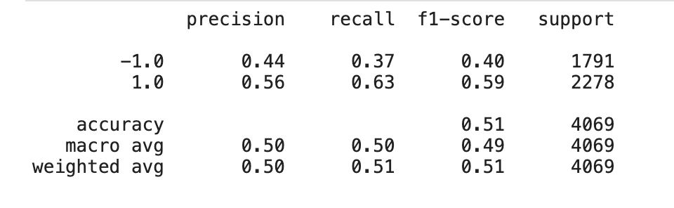
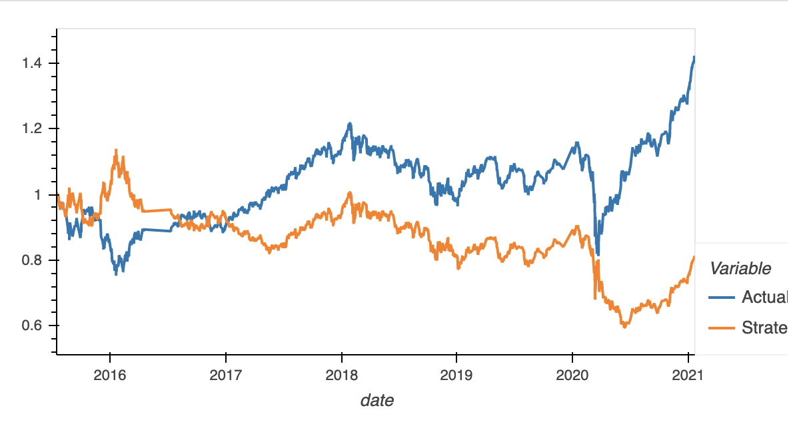

# Algorithmic Trading - Machine Learning Trading Bot

In this challenge, I assumed the role of a financial advisor at one of the top five financial advisory firms in the world. The firm constantly competes with the other major firms to manage and automatically trade assets in a highly dynamic environment. In recent years, they heavily profited by using computer algorithms that can buy and sell faster than human traders.

The speed of these transactions gave this firm a competitive advantage early on. But, people still need to specifically program these systems, which limits their ability to adapt to new data. This required improving the existing algorithmic trading systems to maintain the firm’s competitive advantage in the market. To do so, I enhanced the existing trading signals with machine learning algorithms that can adapt to new data.

---

## Technologies

This project leverages python 3.7 with the following packages:

* [scikit-learn](https://scikit-learn.org/stable/) - Simple and efficient tools for predictive data analysis

---

## Installation Guide

    
To install scikit-learn, open the terminal, and execute the following command:

    pip install -U scikit-learn

---

## Usage

The steps are divided into the following sections:

- Establish a Baseline Performance

- Tune the Baseline Trading Algorithm

- Evaluate a New Machine Learning Classifier

- Create an Evaluation Report

---

## Analysis

#### Establish a Baseline Performance

For the baseline performance results, the classification report shows an accuracy of 55%, which predicts correctly just a bit over half of the time. 

As far as the actual vs strategy returns, our strategy starts to show higher 
returns starting in around 2019. 

#### Tune the Baseline Trading Algorithm

We adjusted the training window to 5 months, which gave us an accuracy of 56%, up just 1% to the 3 month training window, which is not a significant improvement. 

As far as the actual vs strategy returns, our actual returns significatly ourperformed our strategy returns from 2019-2020 and were very close after that period. 

We updated the SMA to 7 and 150 days for this model. This provided us an accurary of 55%, which is where we were at the baseline performace, therefore, this did not increase accuracy. 

As far as the actual vs strategy returns, the strategy returns actually ended up being lower throughout, therefore, the windows we chose were not beneficial in getting better returns. 

The baseline provided better strategy returns, which means we will have to choose different time periods ans SMA's to find better returns!

#### Evaluate a New Machine Learning Classifier

After trying various models, the Liner Regression model provided the highest accuracy (55%), however, it still wasn't better than what we initally got.

This model ended up giving us much lower strategy returns than actual returns!

#### Analysis

After analyzing various models, time periods, and SMA's, I would recommend the original baseline model, as it was the one where the strategy returns actually outperformed the actual returns. 

---

## Contributor

Brought to you by Edgar Coronado

---

## License

MIT